# MDraft Architecture Diagrams
## Visual System Design Documentation

**Version:** 1.0  
**Date:** December 2024  
**Author:** Technical Architecture Team  

---

## Table of Contents

1. [System Overview Diagram](#system-overview-diagram)
2. [Application Architecture](#application-architecture)
3. [Data Flow Diagrams](#data-flow-diagrams)
4. [Deployment Architecture](#deployment-architecture)
5. [Security Architecture](#security-architecture)
6. [Processing Pipelines](#processing-pipelines)
7. [Database Schema](#database-schema)
8. [API Architecture](#api-architecture)

---

## System Overview Diagram

### High-Level System Architecture

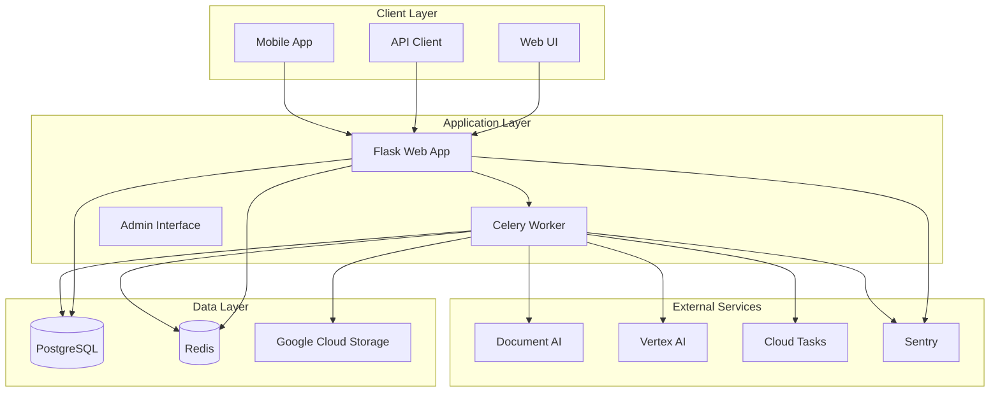

### Component Interaction Flow

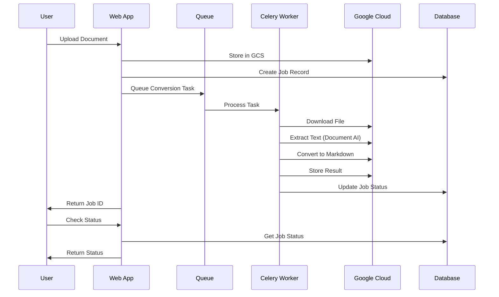

---

## Application Architecture

### Flask Application Structure

```mermaid
graph TD
    subgraph "Flask Application Factory"
        APP[create_app()]
        CONFIG[Configuration]
        EXTENSIONS[Extensions]
        BLUEPRINTS[Blueprints]
    end
    
    subgraph "Extensions"
        DB[SQLAlchemy]
        MIGRATE[Flask-Migrate]
        LOGIN[Flask-Login]
        LIMITER[Flask-Limiter]
        SESSION[Flask-Session]
        CSRF[CSRF Protection]
    end
    
    subgraph "Blueprints"
        MAIN[Main Routes]
        API[API Routes]
        AUTH[Authentication]
        ADMIN[Admin Interface]
        HEALTH[Health Checks]
        WORKER[Worker Routes]
    end
    
    subgraph "Services"
        AI[AI Tools Service]
        STORAGE[Storage Service]
        TEXT[Text Loader Service]
        LLM[LLM Client Service]
    end
    
    APP --> CONFIG
    APP --> EXTENSIONS
    APP --> BLUEPRINTS
    BLUEPRINTS --> SERVICES
```

### Service Layer Architecture

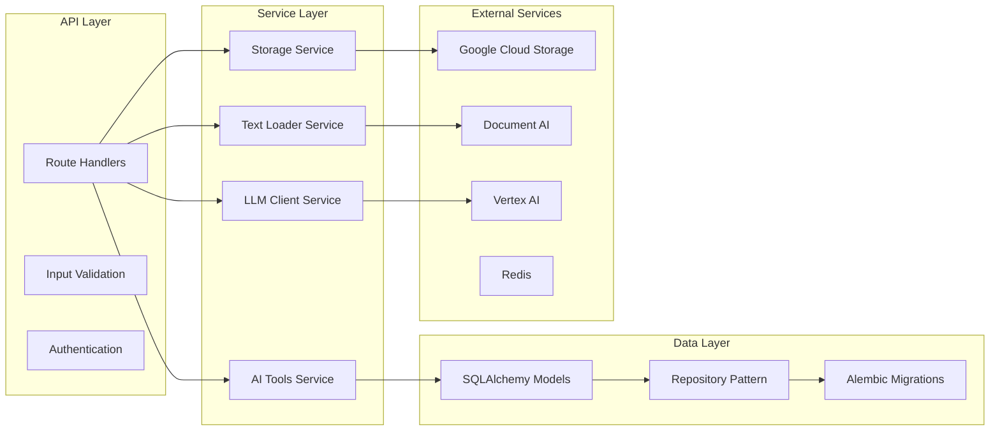

---

## Data Flow Diagrams

### Document Upload Flow

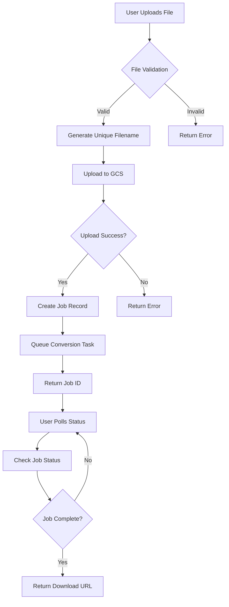

### RFP Analysis Flow

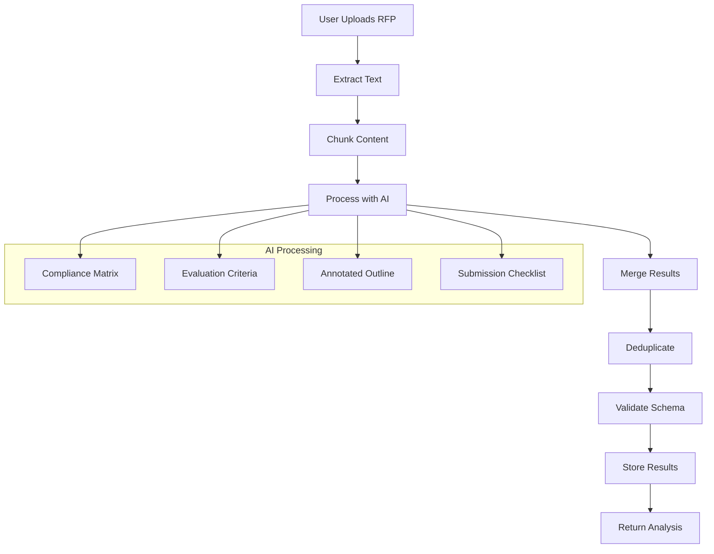

### Authentication Flow

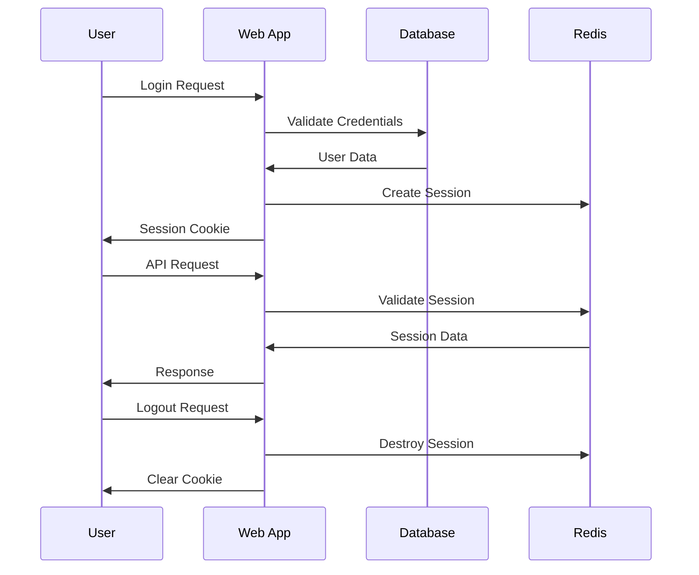

---

## Deployment Architecture

### Render Deployment Structure

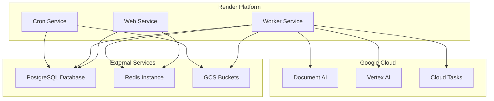

### Environment Configuration

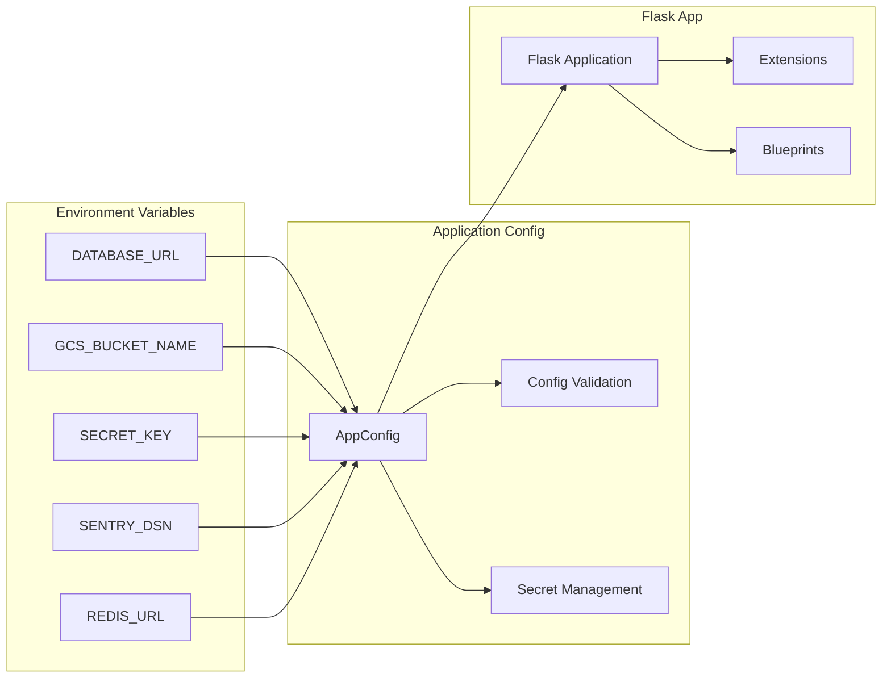

---

## Security Architecture

### Authentication & Authorization Flow

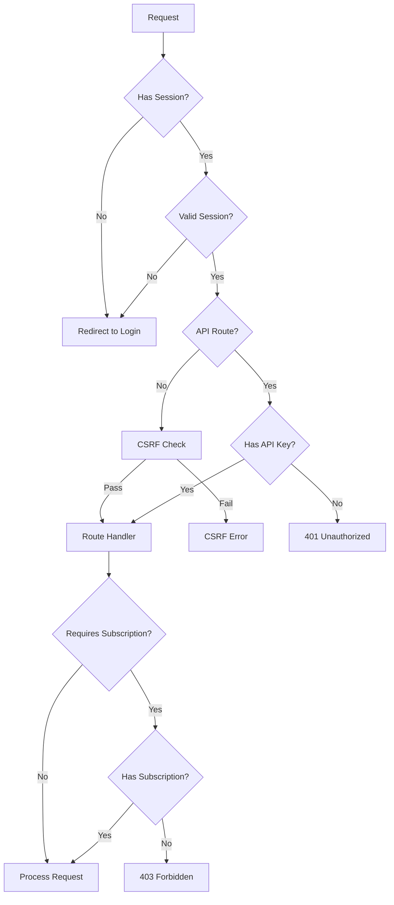

### Security Headers Implementation

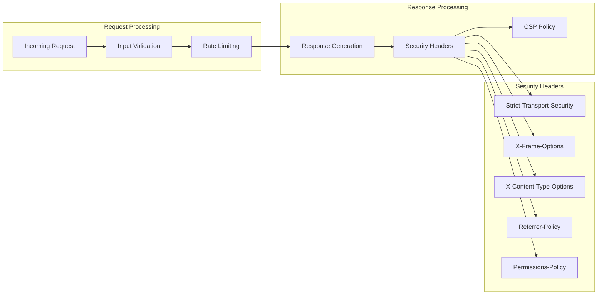

---

## Processing Pipelines

### Document Conversion Pipeline

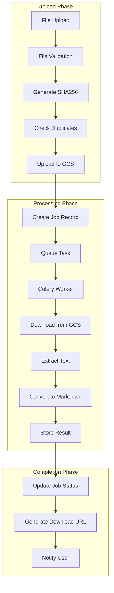

### AI Processing Pipeline

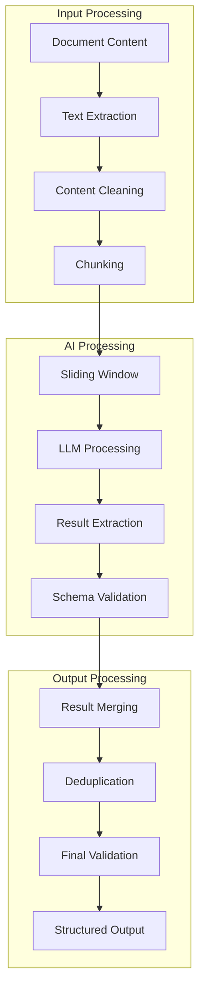

### Error Handling Pipeline

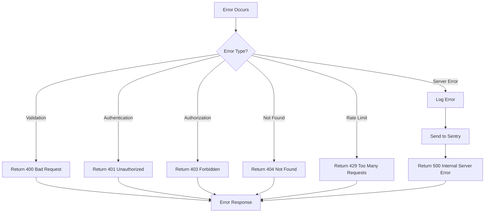

---

## Database Schema

### Entity Relationship Diagram

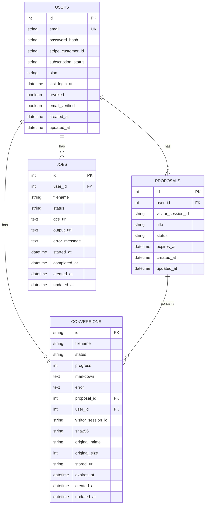

### Database Indexes

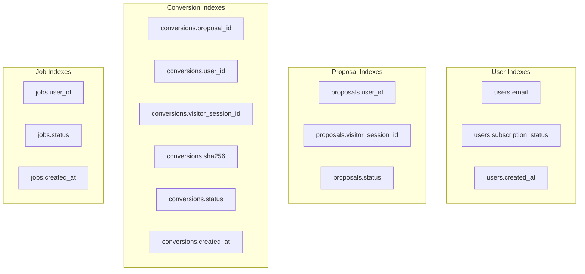

---

## API Architecture

### RESTful API Structure

```mermaid
graph TD
    subgraph "Authentication"
        AUTH_LOGIN[POST /auth/login]
        AUTH_LOGOUT[POST /auth/logout]
        AUTH_REGISTER[POST /auth/register]
    end
    
    subgraph "File Management"
        UPLOAD[POST /api/upload]
        DOWNLOAD[GET /api/download/{filename}]
        STATUS[GET /api/jobs/{job_id}]
    end
    
    subgraph "RFP Analysis"
        COMPLIANCE[POST /api/rfp/compliance-matrix]
        EVALUATION[POST /api/rfp/evaluation-criteria]
        OUTLINE[POST /api/rfp/annotated-outline]
        CHECKLIST[POST /api/rfp/submission-checklist]
    end
    
    subgraph "Proposal Management"
        PROPOSALS[GET /api/proposals]
        PROPOSAL_CREATE[POST /api/proposals]
        PROPOSAL_GET[GET /api/proposals/{id}]
        PROPOSAL_UPDATE[PUT /api/proposals/{id}]
    end
    
    subgraph "Health & Monitoring"
        HEALTH[GET /health]
        MIGRATION_STATUS[GET /api/ops/migration_status]
        METRICS[GET /api/ops/metrics]
    end
```

### API Response Flow

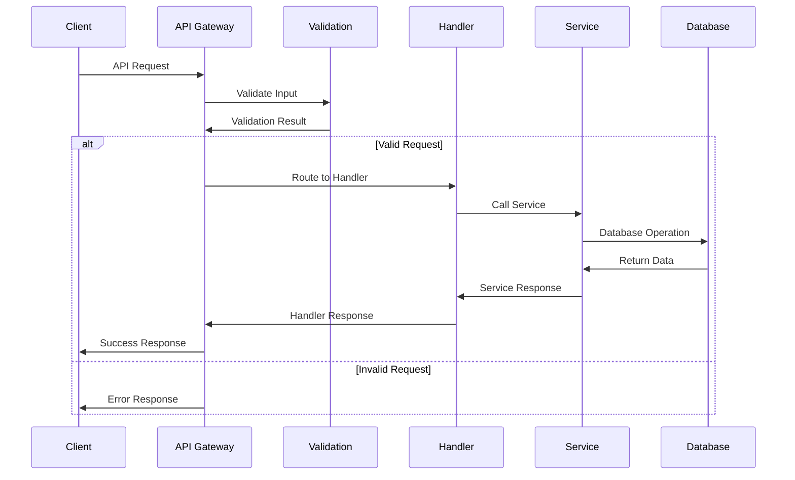

### Rate Limiting Architecture

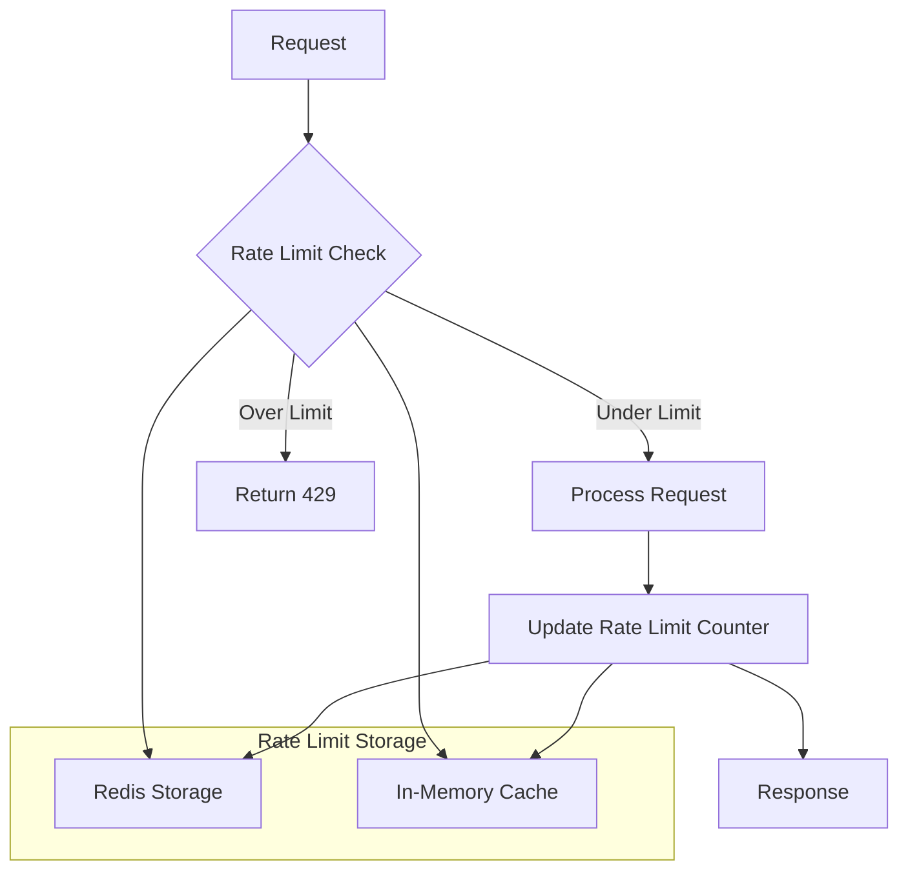

---

## Monitoring & Observability

### Logging Architecture

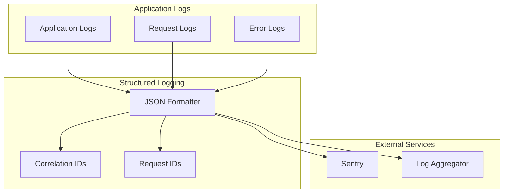

### Health Check Architecture

```mermaid
graph TD
    A[Health Check Request] --> B{Database Check}
    B -->|Healthy| C{Redis Check}
    B -->|Unhealthy| D[Return 503]
    
    C -->|Healthy| E{External Services}
    C -->|Unhealthy| F[Return 503]
    
    E -->|Healthy| G[Return 200 OK]
    E -->|Unhealthy| H[Return 503]
    
    subgraph "Health Checks"
        DB_CHECK[Database Connectivity]
        REDIS_CHECK[Redis Connectivity]
        GCS_CHECK[GCS Connectivity]
        DOCAI_CHECK[Document AI Health]
    end
    
    B --> DB_CHECK
    C --> REDIS_CHECK
    E --> GCS_CHECK
    E --> DOCAI_CHECK
```

---

## Performance Optimization

### Caching Strategy

```mermaid
graph TD
    A[Request] --> B{Cache Hit?}
    B -->|Yes| C[Return Cached Data]
    B -->|No| D[Process Request]
    
    D --> E[Store in Cache]
    E --> F[Return Response]
    
    subgraph "Cache Layers"
        L1[L1 Cache - Memory]
        L2[L2 Cache - Redis]
        L3[L3 Cache - Database]
    end
    
    B --> L1
    B --> L2
    B --> L3
    
    E --> L1
    E --> L2
```

### Connection Pooling

```mermaid
graph TD
    A[Database Request] --> B{Available Connection?}
    B -->|Yes| C[Use Connection]
    B -->|No| D{Max Pool Size?}
    
    D -->|No| E[Create New Connection]
    D -->|Yes| F[Wait for Connection]
    
    C --> G[Execute Query]
    E --> G
    F --> G
    
    G --> H[Return Connection to Pool]
    
    subgraph "Connection Pool"
        POOL[Connection Pool]
        ACTIVE[Active Connections]
        IDLE[Idle Connections]
    end
    
    B --> POOL
    E --> POOL
    H --> POOL
```

---

**Document Control**
- **Version**: 1.0
- **Last Updated**: December 2024
- **Next Review**: March 2025
- **Approved By**: Technical Architecture Team
